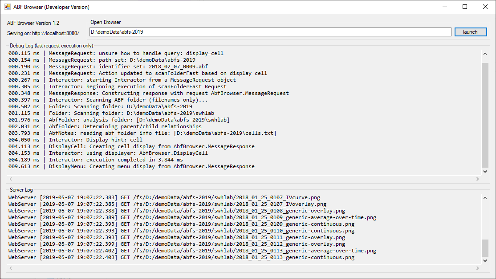
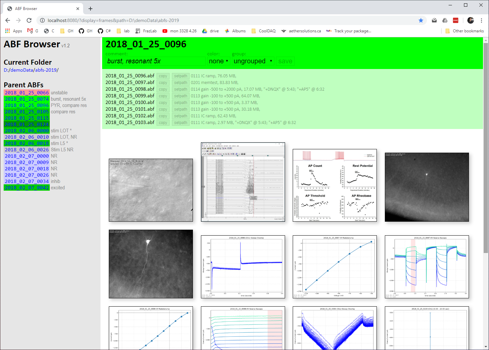

# ABF Browser
**ABF Browser is a Windows application for managing electrophysiology experiment data.** It was designed to navigate and document experiment folders containing large numbers of Axon Binary Format (ABF) files. The ABF Browser is a click-to-run EXE written in C# that serves a website on [http://localhost:8080](http://localhost:8080) (only visible to your computer). This website lets you explore ABF folders, view and modify cell and experiment notes, and even launch analysis scripts (utilizing [pyABF](https://github.com/swharden/pyABF)). While not an immediate goal, this project could be extended using [vsABF](https://github.com/swharden/vsABF) to provide interactive ABF displays.

#### ABF Browser (Server)

### ABF Browser Website (Chrome)
