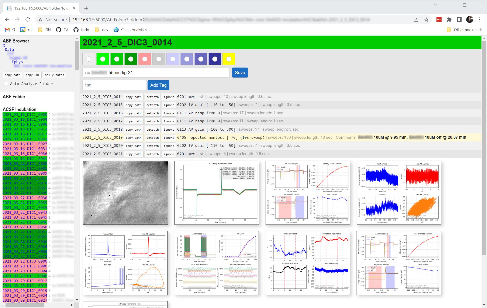

# ABF Browser

**ABF Browser** is a web application for managing electrophysiology projects involving ABF (Axon Binary Format) files.

This project is a .NET/Blazor replacement for a Vanilla JavaScript implementation that has been working well for several years, but requires PHP and Apache and is more difficult to maintain and modify ([jsABF](https://github.com/swharden/jsabf)).

Automated ABF file analysis is currently accomplished using Python ([pyABF](https://swharden.com/pyabf/) and [pyABFauto](https://github.com/swharden/pyABFauto)). In the future this task may be better served by [AbfSharp](https://github.com/swharden/AbfSharp) which uses the official DLL to read ABF files (alleviating the need for a brittle Python setup, ensuring read values are accurate, and supporting future ABF file format versions without requiring code modification).

